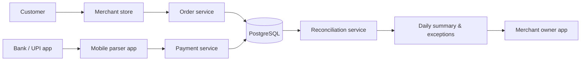

## UpiSettle (backend)

- Go backend to reconcile UPI and cash payments against store orders, so merchants get a clear end-of-day settlement view.
- Exposes a simple JSON API used by mobile/web clients.

### High-level flow

---

# UpiSettle Backend (Go)

UpiSettle is a backend service that helps small offline merchants (kirana shops, retail stores) **reconcile UPI and cash payments against their orders** and get a clear end‑of‑day settlement view.

This repository contains the **backend-only** implementation written in Go, designed as a **modular monolith** that is easy to extend and scale.

---

## Features (MVP)

- **Merchant & stores**
  - Register a merchant owner.
  - Create and list stores for a merchant.
- **Auth**
  - JWT-based authentication for API access.
- **Orders**
  - Create orders per store.
  - List orders for a given day.
- **Payments**
  - Ingest parsed UPI payment events (from mobile app SMS parser).
  - Record manual cash payments against orders.
- **Reconciliation**
  - Match orders and UPI payments by amount for a given day.
  - Create exceptions for unmatched orders/payments or ambiguous matches.
- **Reporting**
  - Per-store daily summary (sales, UPI vs cash totals, matched vs unmatched, exceptions).
  - List exceptions for a given day.

---

## Architecture Overview

High-level layers:

- `cmd/api`: application entrypoint (`main.go`).
- `internal/config`: environment-based configuration (port, DB URL, JWT secret).
- `internal/logger`: simple structured logging wrapper.
- `internal/storage`: database connection (PostgreSQL via GORM).
- `internal/http`: HTTP server setup with Gin, global middlewares, and route wiring.
- Domain modules:
  - `internal/auth`: users, registration, login, JWT middleware.
  - `internal/merchant`: merchants and stores.
  - `internal/order`: orders and basic listing.
  - `internal/payment`: payment ingestion (UPI & cash).
  - `internal/matching`: reconciliation engine and models (`matches`, `exceptions`).
  - `internal/reporting`: daily summaries and exception listings.
- `migrations`: SQL migrations for the relational schema.

The API service is **stateless**; all data is stored in PostgreSQL. This allows horizontal scaling by running multiple instances behind a load balancer.

---

